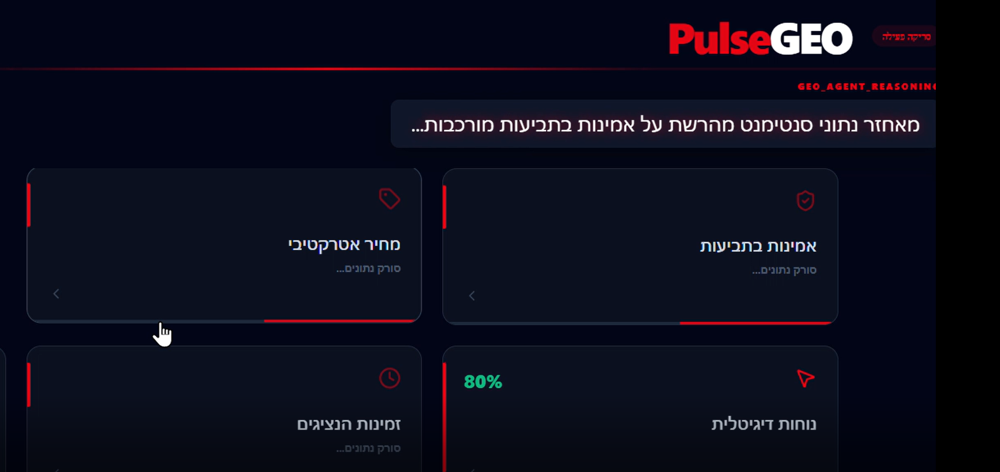
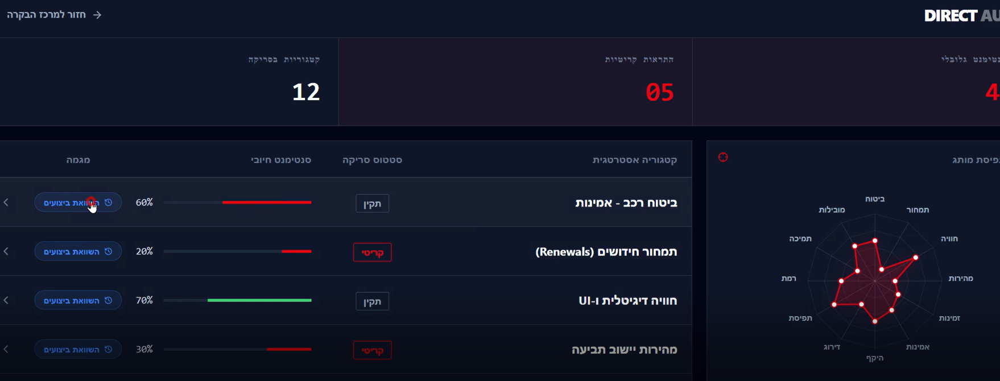

# GEO-Pulse Engine
### Strategic AI Agent for Brand Authority and Reputation Management (GEO)


זהו סוכן חכם שנועד לנטר, לנתח ולבצע אופטימיזציה לנוכחות של מותגים בתוך מנועי תשובה מבוססי AI (כגון ChatGPT, Perplexity ודומי
הם). הפרויקט מתמקד בתחום ה-GEO (Generative Engine Optimization) – הדור הבא של ניהול המוניטין בעידן הבינה המלאכותית היוצרת.

##GEO-Pulse Engine מהווה את ליבת הבינה המלאכותית של מערכת GEO-Pulse.##
## ליבת המערכת - engine.py
**קובץ ה-engine.py מהווה את המוח המרכזי של הפרויקט.** הוא מרכז את כל הלוגיקה האסטרטגית, ניהול ריבוי הסוכנים (Multi-Agent System), והאינטגרציה העמוקה עם LlamaIndex. כל תהליכי ה-Reasoning, ניתוח הנתונים והפקת התובנות האופרטיביות מתבצעים דרך רכיב זה, המנהל את ה-Pipeline מקצה לקצה.

## ערך עסקי ואסטרטגי
בעולם שבו צרכנים מקבלים החלטות על סמך המלצות של מודלי שפה, מותגים מאבדים שליטה על הנרטיב הדיגיטלי שלהם. המנוע של GEO-Pulse מאפשר למנהלי שיווק:

* מעבר מניחוש להחלטות מבוססות נתונים: הבנה מדויקת של תפיסת המותג במודלי LLM בזמן אמת.
* זיהוי פערים אסטרטגיים: השוואה בין נתוני האמת של המותג לבין התשובות שמספקים המודלים.
* מפת דרכים אופרטיבית: קבלת המלצות קונקרטיות לשיפור הסמכות (Authority) והדירוג האלגוריתמי.

## טכנולוגיות מרכזיות
* Python: שפת הפיתוח המרכזית לעיבוד נתונים ולוגיקה (מבוסס engine.py).
* LlamaIndex: ניהול ה-Data Indexing, השליפה (Retrieval) ובניית ה-Workflow של הסוכן.
* Agentic Framework: לוגיקה של סוכן אוטונומי המבצע תהליכי Reasoning (חשיבה) והסקת מסקנות.
* Advanced Prompt Engineering: שימוש בטכניקות מתקדמות להפקת תובנות אסטרטגיות מדויקות.

## תהליך העבודה (Workflow)
1. Data Ingestion: שליפת נתונים רב-מקורית הכוללת מסמכי חברה, דוחות רגולטור וסנטימנט צרכני.
2. AI Analysis: ניתוח המידע באמצעות הסוכן לזיהוי חוסרים והטיות במודלי ה-LLM.
3. Strategic Reasoning: גיבוש אסטרטגיה לתיקון המוניטין ושיפור הדירוג במנועי התשובה.
4. Actionable Roadmap: הפקת המלצות טכניות (Technical Fixes) ותוכן ממוטב להזרקה.

## צילומי מסך והדגמות

### ניתוח תהליך החשיבה של הסוכן (Reasoning)

*תיאור: הצגת לוגיקת הסוכן וניתוח המקורות בזמן אמת דרך ה-engine.*

### דשבורד תובנות אסטרטגיות

*תיאור: ניתוח פערים ומפת דרכים לשיפור נוכחות המותג.*

## התקנה והרצה

### דרישות קדם
* Python 3.10 ומעלה
* מפתח API עבור OpenAI או Anthropic

### שלבי הרצה
1. שכפול המאגר:
```bash
git clone [https://github.com/YOUR_USERNAME/GEO_Plse-engine.git](https://github.com/YOUR_USERNAME/GEO_Plse-engine.git)
